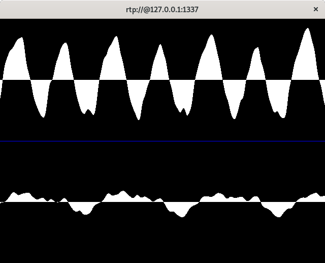

# jitters

jitters is an incomplete RTP jitter buffer demo, written in Rust. What follows is a description of the various subcomponents of jitters based on the directories.

### src

rtp.rs contains some structs for working with a very lean subset of RTP:

* RTP without extensions, custom payload types, or csrcs
* The only supported payload types are 44100Hz L16 uncompressed audio mono and stereo. This means resampling to 44100 is required.
* The marker bit of the header is used to mark the end of a stream (more as a personal convenience, so I know I can start playing the audio stream)
* The initial sequence and timestamp are selected randomly, as recommended by the RFC
    * The sequence is incremented by 1, the timestamp is incremented by the number of samples sent in the packet (i.e. `JITTERS_MAX_PACKET_SIZE - size_of::<RtpHeader>() = 1400 - 12 = 1388`). The timestamp can be converted to `ms` by the receiver using the sample rate

There is a struct for an `RtpOutStream` and `RtpInStream` with no jitter correction. The visualization of an RTP packet and the documentation I used to write the bulk of the code comes from [the original RFC](https://tools.ietf.org/html/rfc3550). The structs are very simple - you'll see later in the examples section that I need to perform manual audio interleaving in the underlying vec storage of `RtpOutStream` to stream stereo audio.

rtp_jitter.rs contains an `RtpJitterInStream`. The jitter correction is as follows:

1. Store the incoming RTP packets into a `Vec<(Vec<u8>, u16, u32)>` where the `Vec<u8>` represents the audio data, `u16` represents the sequence and the `u32` represents the timestamp.
2. Iterate over the vector backwards as long as the sequence value is lower than the tail to find the correct insertion order of the packet.

Inserts to the `RtpJitterInStream` must be done with a mutex or lock.

### examples

#### wav_sender

`wav_sender.rs` uses the [hound](https://github.com/ruuda/hound/) crate to convert a WAV file to an outgoing RTP stream. The stream is recognized by Wireshark and ffplay.

In one command prompt, run `ffplay`:

```
sevagh:jitters $ ffplay -hide_banner rtp://@127.0.0.1:1337
[rtp @ 0x7f011c000b80] Guessing on RTP content - if not received properly you need an SDP file describing it
Input #0, rtp, from 'rtp://@127.0.0.1:1337':
  Duration: N/A, start: 0.000000, bitrate: 1411 kb/s
    Stream #0:0: Audio: pcm_s16be, 44100 Hz, 2 channels, s16, 1411 kb/s
[rtp @ 0x7f011c000b80] jitter buffer full=    0KB sq=    0B f=0/0
[rtp @ 0x7f011c000b80] RTP: missed 443 packets
[rtp @ 0x7f011c000b80] jitter buffer full=    0KB sq=    0B f=0/0
[rtp @ 0x7f011c000b80] RTP: missed 20 packets
[rtp @ 0x7f011c000b80] jitter buffer full=    0KB sq=    0B f=0/0
[rtp @ 0x7f011c000b80] RTP: missed 1 packets
  63.77 M-A:  0.000 fd=   0 aq=  584KB vq=    0KB sq=    0B f=0/0
```

In another, run the wav_sender example:

```
sevagh:jitters $ cargo run --example wav_sender '127.0.0.1:13337' '127.0.0.1:1337' 188692__arseniiv__pianoa-100bpm.wav
    Finished dev [unoptimized + debuginfo] target(s) in 0.03s
     Running `target/debug/examples/wav_sender '127.0.0.1:13337' '127.0.0.1:1337' 188692__arseniiv__pianoa-100bpm.wav`
Sent samples at timestamp 0.0ms with RTP over UDP to 127.0.0.1:1337
Sent samples at timestamp 7.8684807256235825ms with RTP over UDP to 127.0.0.1:1337
Sent samples at timestamp 15.736961451247165ms with RTP over UDP to 127.0.0.1:1337
Sent samples at timestamp 23.605442176870746ms with RTP over UDP to 127.0.0.1:1337
```



### wav_receiver, wav_jitter_receiver

Both examples have a similar threaded structure. There's a [crossbeam ArrayQueue](https://docs.rs/crossbeam/0.7.2/crossbeam/queue/struct.ArrayQueue.html) used as an SPSC between the UDP listener thread and `RtpIn` populator thread.

1. thread 1: read from UDP socket, put packets in an ArrayQueue
2. thread 2: read packets from the ArrayQueue, put them in the `RtpIn` struct with a `write()` RwLock \*
3. thread 3: check the `RtpIn` struct with a `read()` RwLock, and use the [cpal]() crate to play audio on the default interface

I thought of using a [Concurrent Skip List](https://docs.rs/crossbeam-skiplist/0.0.0/crossbeam_skiplist/) for maintaining sorted concurrent packet insertions in the jitter buffer. However, for simplicity, in the caller example I wrap the `RtpJitterInStream` with an [`RwLock`](https://doc.rust-lang.org/std/sync/struct.RwLock.html) instead of a mutex to indicate that I'll only be serially writing to the inner `Vec<(Vec<u8>, u16, u32)>` from a UDP socket.

Similar to the above send/receive test with `ffplay`, run the receiver examples to listen to the WAV file:


```
sevagh:jitters $ cargo run --example wav_jitter_receiver '127.0.0.1:1337'
...
Received 1400 bytes from 127.0.0.1:13337
Stream ended - playing audio...
Corrected 0 out-of-order packets
Yielding audio slice for sequence 0, timestamp 0.0ms
Yielding audio slice for sequence 1, timestamp 7.8684807256235825ms
Yielding audio slice for sequence 2, timestamp 15.736961451247165ms
Yielding audio slice for sequence 3, timestamp 23.60544217687075ms
...
Yielding audio slice for sequence 2437, timestamp 19175.48752834467ms
Yielding audio slice for sequence 2438, timestamp 19183.356009070296ms
Yielding audio slice for sequence 2439, timestamp 19191.224489795917ms
audio done, exiting program
```

In another, run the wav_sender example:

```
sevagh:jitters $ cargo run --example wav_sender '127.0.0.1:13337' '127.0.0.1:1337' 188692__arseniiv__pianoa-100bpm.wav
    Finished dev [unoptimized + debuginfo] target(s) in 0.03s
     Running `target/debug/examples/wav_sender '127.0.0.1:13337' '127.0.0.1:1337' 188692__arseniiv__pianoa-100bpm.wav`
Sent samples at timestamp 0.0ms with RTP over UDP to 127.0.0.1:1337
Sent samples at timestamp 7.8684807256235825ms with RTP over UDP to 127.0.0.1:1337
Sent samples at timestamp 15.736961451247165ms with RTP over UDP to 127.0.0.1:1337
Sent samples at timestamp 23.605442176870746ms with RTP over UDP to 127.0.0.1:1337
...
Sent samples at timestamp 19175.487528344514ms with RTP over UDP to 127.0.0.1:1337
Sent samples at timestamp 19183.35600907014ms with RTP over UDP to 127.0.0.1:1337
End... set the market bit
Sent samples at timestamp 19191.224489795764ms with RTP over UDP to 127.0.0.1:1337
```

### xdp

Currently in progress - an XDP program that will intercept and swap around the RTP packets sent by `wav_sender.rs`, to demonstrate jitter working in adverse network conditions.

### android

Coming soon - compiling jitters for NDK, and using [Oboe](https://github.com/google/oboe) to stream audio from an Android phone's microphone to an RtpServer running on Linux.

### wireshark

Coming soon - a custom wireshark dissector for performing a streaming FFT on the audio buffers in the RTP packets. This is more for show than useful.
